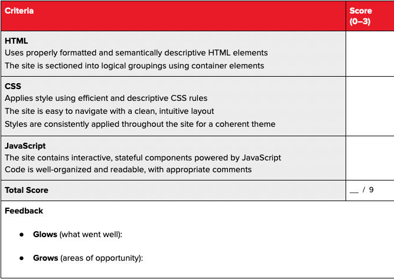

## Final Project

For the final project, you'll be designing and building a website of your choice. This project will test your knowledge of front-end web development and ask you to apply everything you've learned in this course. The result will be a website that you can add to your portfolio. You could create: a portfolio website; a marketing website for a startup or business; or a prototype for a simple web-app. Work with your instructor to create project goals that are realistic given the scope and timing of the class.

## Objectives
- Demonstrate an understanding of all topics covered during the course:
  - Structure, design, and style your site with HTML and CSS
  - Use JavaScript to make your site interactive
  - Combine technical and design skills to create a responsive website that is compatible with mobile devices
- Apply knowledge gained during this course by building a website from scratch
- Use your creativity

## Requirements
Use HTML to correctly structure the DOM:
- Use HTML5 structural elements (header, footer, nav, etc..)
- Demonstrate correct use of classes and IDs
- Select appropriate tags to markup content

Use CSS to style the page:
- Apply fonts, color, and styles to elements and the page
- Demonstrate use of flex or grid properties and the box model

Use JavaScript to add interactive elements to the page

## Submission Guildelines
You should submit a link to your Final Project code on Github and a link to your deployed site ( we will walk through this together ) by the end of class on December 20, 2022

## Evaluation Rubric
Your instructor will review your project and evaluate it against the rubric below.  You will receive a score of 0-3 for each criterion:
- 0: Missing/incomplete
- 1: Does not meet expectations
- 2: Meets expectations
- 3: Exceeds expectations

Your grade will be the sum of these scores.  All scores must be greater than 0 for a passing grade.

# coding.github.io
